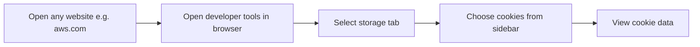

# Set & Read Cookie


Browser have deferent type of storage(Still now 4). one of them is cookie not this 🍪. which is common for storing lots of thing. In this Section, you will learn to store data in user's browser.Also rememeber cookie is key-value pair storage. Every data have a key to access it. You can see it, go any website example: [aws.com](https://aws.amazon.com), then open developer tools in browser, then go storage tab & select cookies from left-sidebar. You can see key-value data & also some metadata, like expire, path, httponly(which means secure or not) etc.They are commonly used for various purposes, such as maintaining session state, storing user preferences, and tracking user behavior.



{/* Todo: Add Screenshot And Mermaid diagram */}

As we already know, cookie information is contained in the **request and response headers**. Cookies can be set from the server to the browser. This lesson, we'll carry it out.

#### Challenge 1: Create a Route to Set Cookies
    - In your Express app, create a route `/createcookies`. Inside this route, use `res.cookie()` to set a cookie named `secret_data` with the value `"Take it, don't break it, I wanna see you taste it"`.
    <details>
      <summary> Solution </summary>
      ```js showLineNumbers copy
        app.get('/createcookies', (req, res) => {
          res.cookie('secret_data', "Take it, don't break it, I wanna see you taste it");
          res.send('Cookie is set');
        });
      ```
    </details>
     

#### Challenge 2: Create a Route to Display Cookies
   - Set up another route `/showcookies` to read the cookies set in the browser and display them in HTML.
   - Use `req.cookies` to access the cookies and send them back in the response.
    <details>
        <summary> Solution </summary>
      ```js showLineNumbers copy
        app.get('/showcookies', (req, res) => {
          const cookieData = req.cookies.secret_data;
          res.send(`<html><body><p>Cookie Data: ${cookieData}</p></body></html>`);
        });
      ```
    </details>

     

#### Challenge 3: Create a Route to Delete Cookies
   - Add a `/deletecookies` route that deletes the `secret_data` cookie.
   - Use `res.clearCookie()` to remove the specified cookie.
   <details>
      <summary> Solution </summary>
        ```js showLineNumbers copy
          app.get('/deletecookies', (req, res) => {
            res.clearCookie('secret_data');
            res.send('Cookie deleted');
          });
       ```
    </details>
   

#### Challenge 4: Encrypt Cookie Data
   - Modify the `/createcookies` route to encrypt the cookie value.
   - Use a library like `crypto` to encrypt the data with the salt `"secret text, no one can know"`.
   <details>
    <summary> Solution </summary>
    ```js showLineNumbers copy
     const crypto = require('crypto');
     const algorithm = 'aes-256-cbc'; 
     const key = crypto.scryptSync('secret text, no one can know', 'salt', 32);
     const iv = crypto.randomBytes(16);

     app.get('/createcookies', (req, res) => {
       let cipher = crypto.createCipheriv(algorithm, key, iv);
       let encrypted = cipher.update("Take it, don't break it, I wanna see you taste it", 'utf8', 'hex');
       encrypted += cipher.final('hex');
       res.cookie('secret_data', { data: encrypted, iv: iv.toString('hex') });
       res.send('Encrypted cookie is set');
     });
     ```
  </details>
     

#### Challenge 5: Decrypt Cookie Data in `/showcookies`
   - Update the `/showcookies` route to decrypt the cookie value before sending it back.
   - Use the same key and IV for decryption.

   <details>
    <summary> Solution </summary>
    ```js showLineNumbers copy
     app.get('/showcookies', (req, res) => {
       let encryptedData = req.cookies.secret_data.data;
       let iv = Buffer.from(req.cookies.secret_data.iv, 'hex');
       let decipher = crypto.createDecipheriv(algorithm, key, iv);
       let decrypted = decipher.update(encryptedData, 'hex', 'utf8');
       decrypted += decipher.final('utf8');
       res.send(`<html><body><p>Decrypted Cookie Data: ${decrypted}</p></body></html>`);
     });
     ```
  </details>
     


    > "With cookies, you can implement this: When a user logs in, create a cookie for them. One cookie is sent to their browser and the other is saved in your database. When the user visits another route on your webpage, you can identify them by verifying the saved data in your database against their cookie data. This allows users to browse your site smoothly. However, there is a problem: every time a user visits a new route, you need to query data from your database. As a result, 1. If the user re-logs in, your database keeps getting bigger and bigger. 2. The more users you have, the bigger your database becomes, and so on.
    > **But there's a solution named JWT. It's really amazing.**"
    
Real World Scenarion normal cookie and JWT