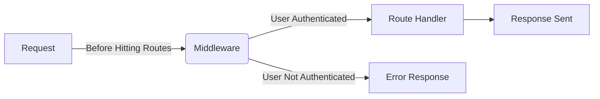

# Middleware

writing a function over and over again for each route is not a good idea. Instead, we can create a middleware function and use it for each route.

Middleware is a function that runs before the main code of each route. It can be used to verify if the user is logged in, or to check if the user has the right permissions to access the route.

#### A user authencation middleware can be written as follows:

#### Challenge 1: Hello Middleware
Create a middleware in ExpressJS that logs "こんにちは" to the console every time any route is accessed. Apply this middleware to your Express app.

  
 Solution 

  
Todo: Add Solution

#### Challenge 2: Route-specific Middleware
Write a middleware that logs "Route-specific middleware accessed" and apply it only to the route `/middlewareused`. This middleware should not affect other routes.

  
 Solution 

  
Todo: Add Solution

#### Challenge 3: Request-Time Logger
Develop a middleware that logs the current date and time (in a human-readable format) each time a request is made to your server. Apply this middleware globally in your Express app.

  
 Solution 

  
Todo: Add Solution

#### Challenge 4: Request Counter
Create a middleware that counts the number of requests made to the server. It should keep a running total and log this count to the console with each request. This middleware should be applied globally.

  
 Solution 

  
Todo: Add Solution

#### Challenge 5: Header Checker
Write a middleware that checks if a request contains a specific header, say `X-Special-Header`. If the header is present, it should log "Header present" to the console; otherwise, log "Header missing". Apply this middleware to a specific route of your choice, like `/check-header`.

  
 Solution 

  
Todo: Add Solution

#### Challenge 6: Cookie Checker Middleware
Create three routes in your ExpressJS application: `/start`, `/middle`, and `/end`. Implement a functionality where users are required to visit `/start` before they can access `/middle` or `/end`. 

1. When a user visits `/start`, set a cookie with the name `const c = 'i love cookie'`.
2. Develop a middleware that checks for the presence of this cookie. If the cookie `i love cookie` is not present, the user should not be allowed to access the routes `/middle` and `/end`.
3. Apply this middleware to the `/middle` and `/end` routes to ensure that they can only be accessed after visiting `/start` and receiving the cookie.

  
 Solution 

  
Todo: Add Solution

